# Soundcheck DRF API

**Developer: Michael Roberts**

💻 [Live link](https://soundcheck-drf-api-15efb796f01f.herokuapp.com/)

This repository contains the API set up using Django REST Framework for the Soundcheck front-end application ([repository here]() and [live website here]())

## Table of Contents
  - [User Stories](#user-stories)
  - [Database](#database)
  - [Technologies Used](#technologies-used)
  - [Validation](#validation)
  - [Testing](#testing)
  - [Credits](#credits)

## User Stories
- As an admin user, I want to be able to create, edit and delete the users, posts, comments and likes, so that I can have a control over content posted on the application and remove any potentially inappropriate content.

## Database

#### User Model
#### Profile Model
#### Post Model
#### Follower Model
#### Comment Model
#### Like Model

## Technologies Used
### Languages & Frameworks
- Python
- Django

### Libraries & Tools
- [APITestCase](https://www.django-rest-framework.org/api-guide/testing/) - Django Rest Framework APITestCase was used for automated testing
- [Cloudinary](https://cloudinary.com/) to store static files
- [Git](https://git-scm.com/) was used for version control via Gitpod terminal to push the code to GitHub
- [GitHub](https://github.com/) was used as a remote repository to store project code
- [Gitpod](https://gitpod.io/workspaces) - a virtual IDE workspace used to build this site
- [Heroku](https://heroku.com) was used to deploy the project into live environment
- [Django REST Framework](https://www.django-rest-framework.org/) was used to build the back-end API
- [Django AllAuth](https://django-allauth.readthedocs.io/en/latest/index.html) was used for user authentication
- [Pillow](https://pillow.readthedocs.io/en/stable/) was used for image processing and validation
- [Psycopg2](https://www.psycopg.org/docs/) was used as a PostgreSQL database adapter for Python
- [ElephantSQL](https://www.postgresql.org/) – deployed project on Heroku uses an ElephantSQL database

## Validation

### PEP8 Validation

## Testing
### Manual testing of user stories
- As an admin user, I want to be able to create, edit and delete the users, posts, comments and likes, so that I can have a control over content posted on the application and remove any potentially inappropriate content.

**Test** | **Action** | **Expected Result** | **Actual Result**
-------- | ------------------- | ------------------- | -----------------
User | Create, update & delete user | A user can be created, edited or deleted | Works as expected
User | Change permissions | User permissions can be updated | Works as expected
Profile | Create, update & delete | User profile can be created, edited or deleted | Works as expected
Post | Create, update & delete | A post can be created, edited or deleted | Works as expected
Comment | Create, update & delete | A comment can be created, edited or deleted | Works as expected
Like | Create & delete | A like can be created or deleted (like/unlike post) | Works as expected
Follower | Create & delete | Follow or unfollow user | Works as expected

In addition, posts, comments, likes and following can be created by logged-in users only. Users can only update or delete content posted by themselves.

Screenshots - USER

    

Create user

    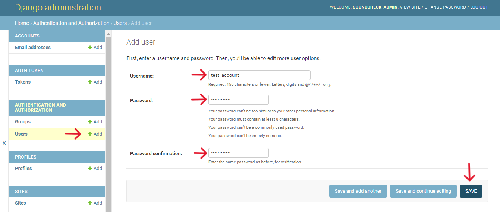
    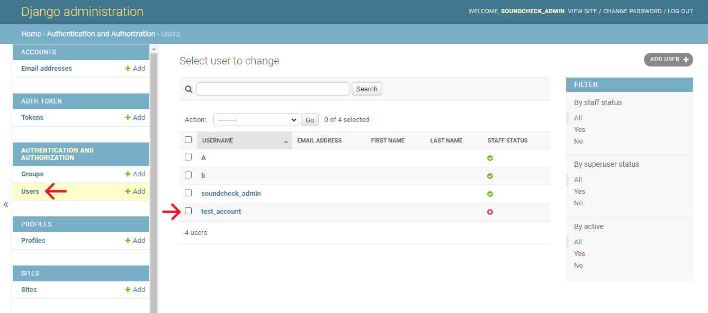
    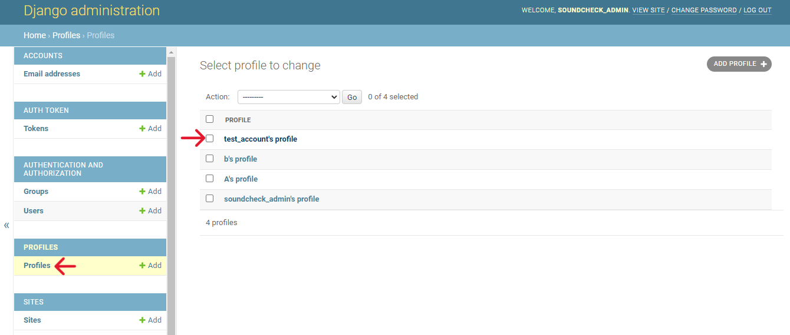
    

    

Change user permissions

    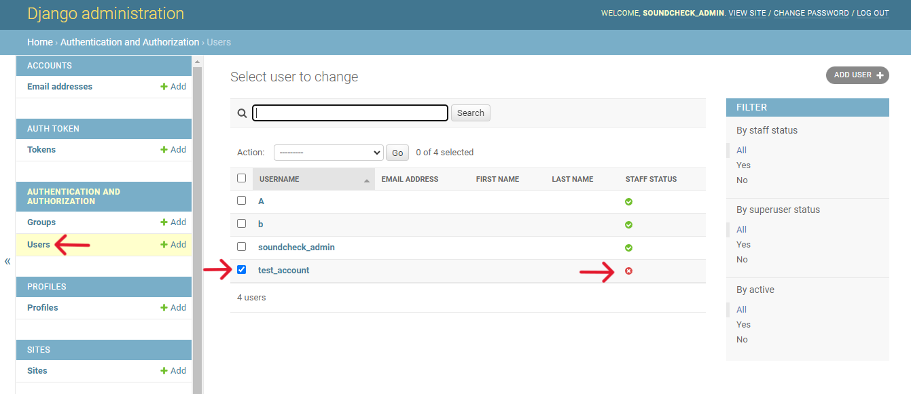
    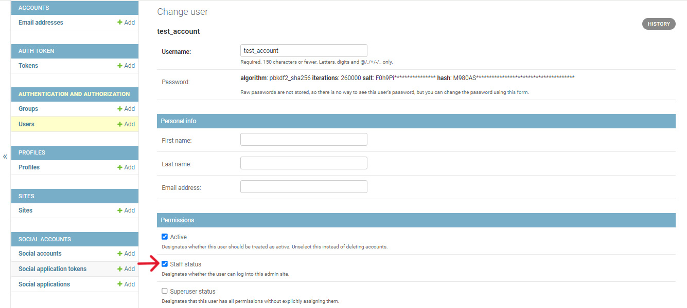
    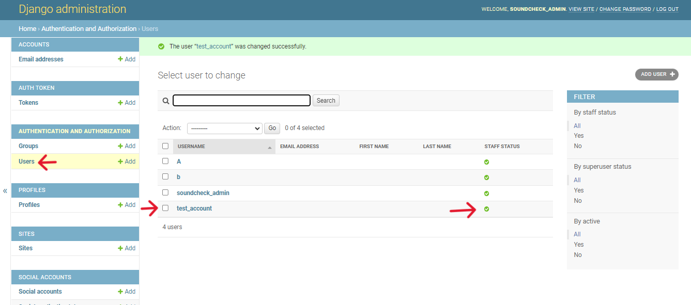
    

Screenshots - PROFILE

    

Update profile

    
    
    
    

    

Delete profile

    
    
    
    

    

Create profile

    
    
    
    

### Automated testing
Automated testing was done using the Django Rest Framework APITestCase.

- Tests summary

Profiles Tests

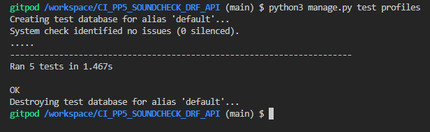

Posts Tests

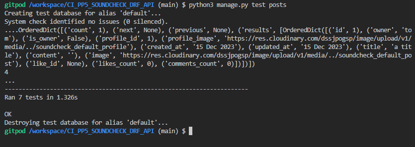

Followers Tests

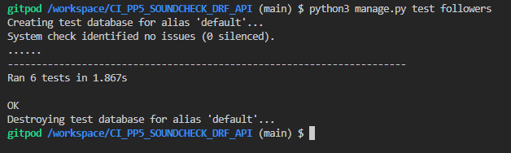

Likes Tests

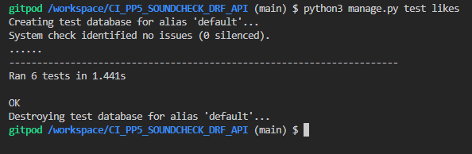

Comments Tests

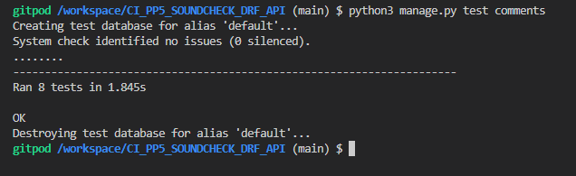

Combined Tests

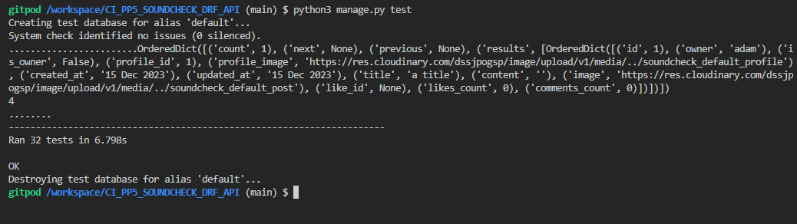

## Credits

### Images
### Code